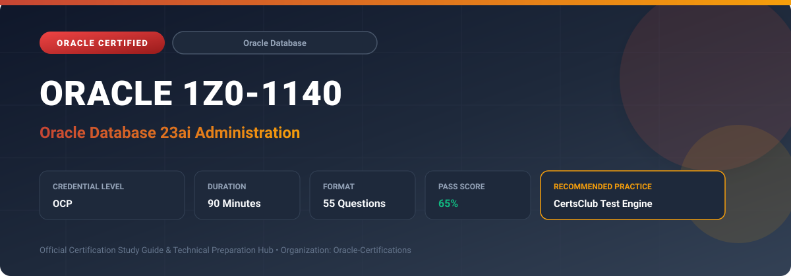

  

# Oracle 1Z0-1140: Oracle Database 23ai Administration

---

## 1. Exam Overview & Candidate Profile

The **Oracle 1Z0-1140: Oracle Database 23ai Administration** certification confirms expert capabilities in installing, managing, backing up, tuning, and securing Oracle Database 23ai enterprise instances.

Candidates validate hands-on proficiency in multitenant architecture (CDB/PDB), AI Vector Search administration, True Cache setup, JSON Relational Duality, unified auditing, automatic tablespace management, and RMAN recovery.

### Target Audience & Prerequisites
- **Target Roles**: Implementation Specialists, Cloud Architects, Technical Leads, Enterprise Consultants, and Systems Engineers.
- **Recommended Experience**: 1–2 years of practical, hands-on experience designing, implementing, and maintaining corresponding Oracle solutions.
- **Credential Earned**: OCP Certification.

---

## 2. Key Exam Specifications

| Specification | Details |
| :--- | :--- |
| **Exam Code** | **Oracle 1Z0-1140** |
| **Official Title** | Oracle Database 23ai Administration |
| **Certification Track** | Oracle Database |
| **Exam Duration** | 90 Minutes |
| **Number of Questions** | 55 Questions |
| **Passing Score** | 65% |
| **Question Format** | Multiple Choice (Single/Multiple Answer), Scenario-Based Questions |
| **Delivery Provider** | Oracle University / Pearson VUE (Online Proctored or Test Center) |
| **Recommended Practice Engine** | [CertsClub Oracle Practice Tests](https://www.certsclub.com/oracle/1z0-1140-dumps.html) |

---

## 3. Official Blueprint & Exam Domain Breakdown

The examination assesses candidate competencies across core functional domains weighted as follows:

| Domain Area | Weighting |
| :--- | :--- |
| **Oracle Database 23ai Architecture & Multitenant Management** | `25%` |
| **AI Vector Search & Modern Developer Features Administration** | `25%` |
| **True Cache, Performance Tuning & Memory Optimization** | `20%` |
| **Backup, Restore & Disaster Recovery (RMAN & Data Guard)** | `15%` |
| **Database Security, Unified Auditing & Privilege Management** | `15%` |

---

## 4. Deep Dive into Complex & Challenging Technical Topics

To secure a passing score on the 1Z0-1140 exam, candidates must master the following advanced concepts:

- Managing Pluggable Databases (PDBs): hot cloning, relocation with zero downtime, and refreshable clones.
- Administering AI Vector Search: allocating vector memory pools, creating VECTOR columns, and maintaining HNSW/IVF indexes.
- Deploying Oracle True Cache: configuring in-memory read caching on separate nodes to offload primary database traffic.
- Implementing unified auditing, privilege analysis, transparent data encryption (TDE), and SQL Firewall.
- Performing advanced RMAN operations, flashback technology, and active Data Guard synchronization.

---

## 5. Scenario-Based Demo & Practice Questions

### Question 1
Which new security feature introduced in Oracle Database 23ai inspects incoming SQL traffic in real time and automatically blocks unauthorized SQL queries or SQL injection attempts based on an authorized baseline?

A) Oracle SQL Firewall
B) Virtual Private Database
C) Transparent Data Encryption
D) Data Redaction

- **Correct Answer**: `A) Oracle SQL Firewall`  
- **Technical Explanation**: Oracle SQL Firewall is built directly into the Oracle Database 23ai kernel. It trains on authorized application workloads and blocks unauthorized SQL and SQL injection attacks.

---

### Question 2
How does Oracle True Cache improve the scalability of database applications in Oracle Database 23ai?

A) By maintaining a diskless, read-only in-memory replica that automatically serves read queries, freeing up primary database resources
B) By compressing tables onto slow archival tape storage
C) By converting all SQL queries into binary code
D) By disabling transaction logs

- **Correct Answer**: `A) By maintaining a diskless, read-only in-memory replica that automatically serves read queries, freeing up primary database resources`  
- **Technical Explanation**: True Cache is an in-memory, read-only cache node that sits in front of the primary database. Read-mostly queries are automatically directed to True Cache to dramatically increase throughput.

---

## 6. Recommended Preparation Strategy & Practice Testing Engine

Achieving certification in **Oracle 1Z0-1140** requires balanced theoretical study and scenario-based simulation practice:

1. **Review Oracle Documentation**: Master architecture guides, implementation workbooks, and administration manuals on the Oracle Help Center.
2. **Hands-on Lab Practice**: Execute real-world configuration, policy setup, and troubleshooting tasks in your cloud tenancy or test instance.
3. **Simulated Exam Drills**: Practice answering timed, scenario-based multiple-choice questions to familiarize yourself with the question formats, traps, and timing constraints.

### Practice With CertsClub
For realistic practice questions, updated dumps, and mock testing environments:
- **Resource**: [CertsClub Oracle Practice Test Engine](https://www.certsclub.com/oracle/1z0-1140-dumps.html)
- **Special Discount**: Use coupon code **`club20`** during checkout for an instant **20% discount** on all practice exam bundles and testing engines.

---

## 7. Official Documentation & References

- [Oracle University Certification Registry](https://education.oracle.com/)
- [Oracle Help Center Documentation Portal](https://docs.oracle.com/)
- [Oracle Cloud Infrastructure & Applications Guides](https://docs.oracle.com/en/cloud/)
- [CertsClub Oracle Certification Exam Practice](https://www.certsclub.com/oracle/1z0-1140-dumps.html)

---

## 8. SEO & Discovery Keywords

`oracle 1z0-1140, oracle 1z0-1140 exam, oracle 1z0-1140 dumps, 1Z0-1140 practice questions, 1Z0-1140 study guide, oracle database 23ai administration, certsclub 1z0-1140`